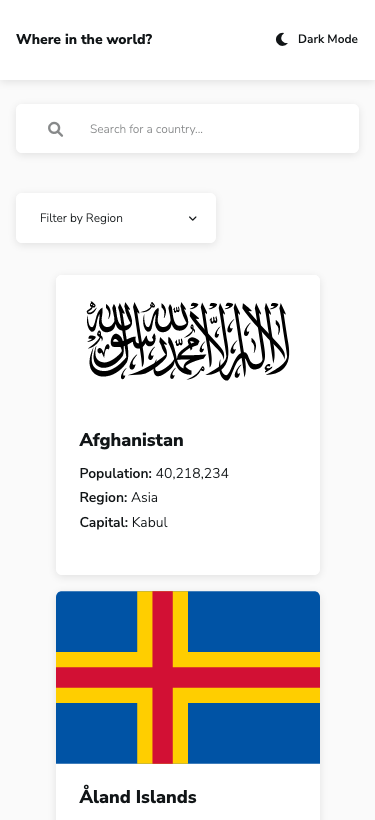
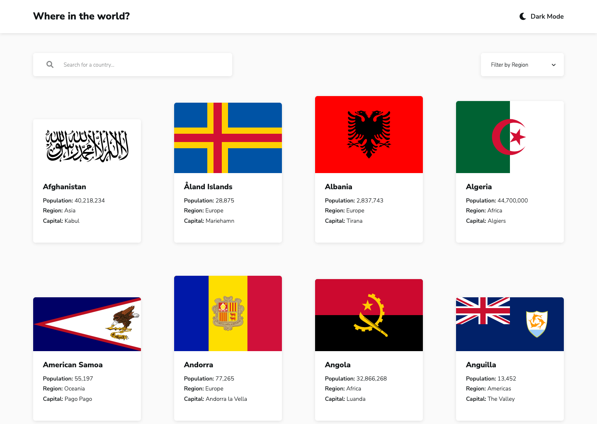

# Frontend Mentor - REST Countries API with color theme switcher solution

This is a solution to the [REST Countries API with color theme switcher challenge on Frontend Mentor](https://www.frontendmentor.io/challenges/rest-countries-api-with-color-theme-switcher-5cacc469fec04111f7b848ca). Frontend Mentor challenges help you improve your coding skills by building realistic projects. 

## The challenge

Users should be able to:

- See all countries from the API on the homepage
- Search for a country using an `input` field
- Filter countries by region
- Click on a country to see more detailed information on a separate page
- Click through to the border countries on the detail page
- Toggle the color scheme between light and dark mode *(optional)*

## Screenshot

### Mobile

### Desktop

## Built with

- Semantic HTML5 markup
- CSS custom properties
- Flexbox
- CSS Grid
- Mobile-first workflow
- Vanilla JS
- REST Countries V2 API

## What I learned

This project felt like the culmination of everything I've learned so far. I used CSS Grid for the flags which auto-fit the viewport width, I implemented the dark mode option, and I got the search filter and drop-down filter to function correctly. I figured out how to use the API to obtain the country information. I am particularly pleased that I managed to get the 'border countries' to appear as buttons and when the border country is clicked, it will become the featured country (confusing to explain, so check out the page and see!).

Undoubtedly there are many improvements that can be made to my code. I struggled to think of suitable class names for some of the elements and I can definitely tidy up the JS code a little and perhaps add more comments for readability. Furthermore, I feel I have neglected accessibility somewhat as I did not get around to testing with a screen reader. I think this was because I was so focused the functionality of the page.

My take-away from this project is to spend more time planning the structure for the page instead of jumping straight in.

## Continued development

This was the first advanced FEM challenge I have completed. I will see if I can tackle a guru challenge next and make sure I spend more time at the beginning to plan the page and identify any potential issues that may arise later.
